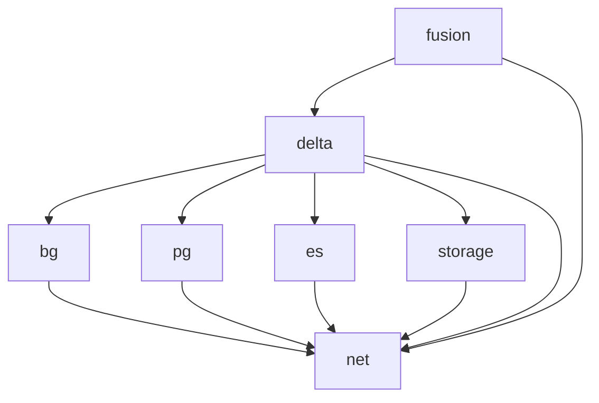

# Nexus Infrastructure

## Local development
A working local environment can be setup as follows:

1. Get access to the AWS sandbox account as an admin using the details specified in the NISE 1password account.
2. Login and generate security credentials if they don't already exist ([docs](https://docs.aws.amazon.com/IAM/latest/UserGuide/security-creds.html)).
3. Setup the AWS CLI with these credentials ([docs](https://docs.aws.amazon.com/cli/latest/userguide/getting-started-quickstart.html)).
4. Assuming terraform is installed, run `terraform init` at root to install modules. `terraform plan` can then be used to verify that the AWS connection has been established.

Following these setup steps, the fastest way to get feedback from changes is to start small by working within a submodule. There is not currently an automatic mechanism for sharing [terraform state](https://developer.hashicorp.com/terraform/language/state) between Nexus developers. To get the most accurate results for `terraform plan` and `terraform apply`, state can be shared manually (in S3, for example). Putting `*.tfstate` files in the appropriate module will allow developers to see local changes reflected in the output of the terraform commands.

When a merge request is opened, the 'real' state will be used to validate the changes. This is associated with AWS production environment and is stored in GitLab.

## Modules

Nexus is divided into the following terraform modules:
1. Networking. Outputs the shared subnet for use in other modules.
2. Blazegraph. ECS image pulled from our fork `bluebrain/blazegraph-nexus`.
3. Postgres. Managed AWS RDS service.
4. Elasticsearch. Managed AWS OpenSearch service.
5. Delta. ECS image pulled from `bluebrain/nexus-delta`.
6. Fusion. ECS image pulled form `bluebrain/nexus-web`.
7. Ship. ECS image pulled from `bluebrain/nexus-ship`.

Inputs to each _submodule_ are passed in via the nexus `main.tf` file. Inputs to the nexus module itself are specified in the `variables.tf` file. Any variable without a default value will be passed in from the `main.tf` at the root of this repository. Some of these values come from a shared [deployment-common](https://bbpgitlab.epfl.ch/cs/cloud/aws/deployment-common) repository. In sandbox we create our own infrastructure and pass these to the nexus module, allowing us to work independently.

## Dependencies

