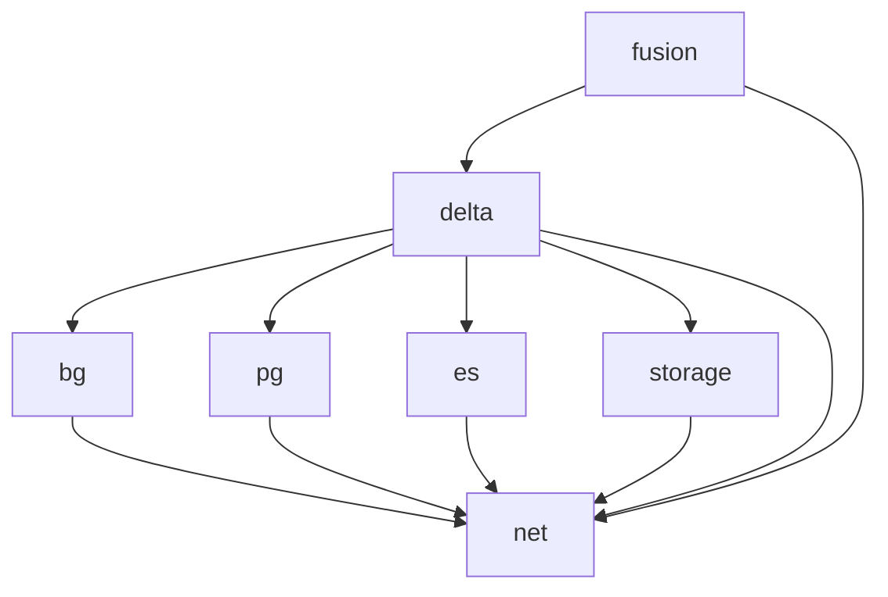

# Nexus Infrastructure
The below is WIP, to give an idea of where we're going.

Nexus will be divided into the following terraform modules:
1. Networking. Outputs the shared subnet for use in other modules.
2. Blazegraph. ECS image pulled from our fork `bluebrain/blazegraph-nexus`.
3. Postgres. Managed AWS RDS service.
4. Elasticsearch. Managed AWS OpenSearch service.
5. Nexus Storage Service. ECS image pulled form `bluebrain/nexus-storage`.
6. Delta. ECS image pulled from `bluebrain/nexus-delta`.
7. Fusion. ECS image pulled form `bluebrain/nexus-web`.

## Dependencies

## Blazegraph
Inputs
- Standard shared VPC details
- Subnet details outputted from `networking` module

Defines
- Private ALB across two AZs. 2 subnets are needed - this is an AWS requirement. This was previously an input, but it need not be? TODO move this to a loadbalancer module.
- ECS stuff - task / service
- Sec group, ingress and egress rules.

## Manual steps
Things we haven't yet been able to do automatically
1. Creating directories in EFS. This was for Blazegraph but most steps should be the same for all:
  - Create an EC2 instance with access to the subnet
  - Go to EFS in the console, click "Access" and copy the NFS command
  - SSH onto the EC2 instance
  - Install NFS, see [docs](https://docs.aws.amazon.com/efs/latest/ug/wt1-test.html#wt1-connect-install-nfs-client)
  - Create a folder for the mount. This and the rest of the commands are listed in [./blazegraph/blazegraph-efs-init.sh](./blazegraph/blazegraph-efs-init.sh)
        
        
